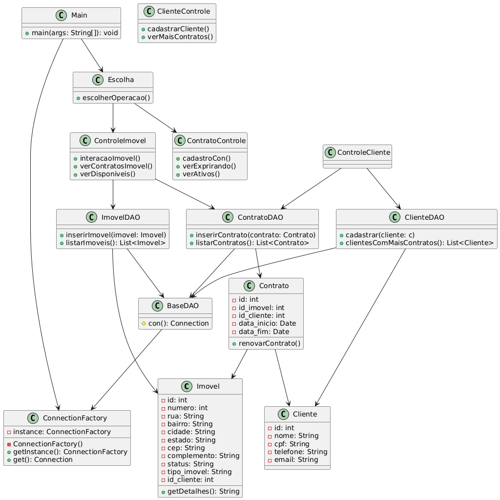
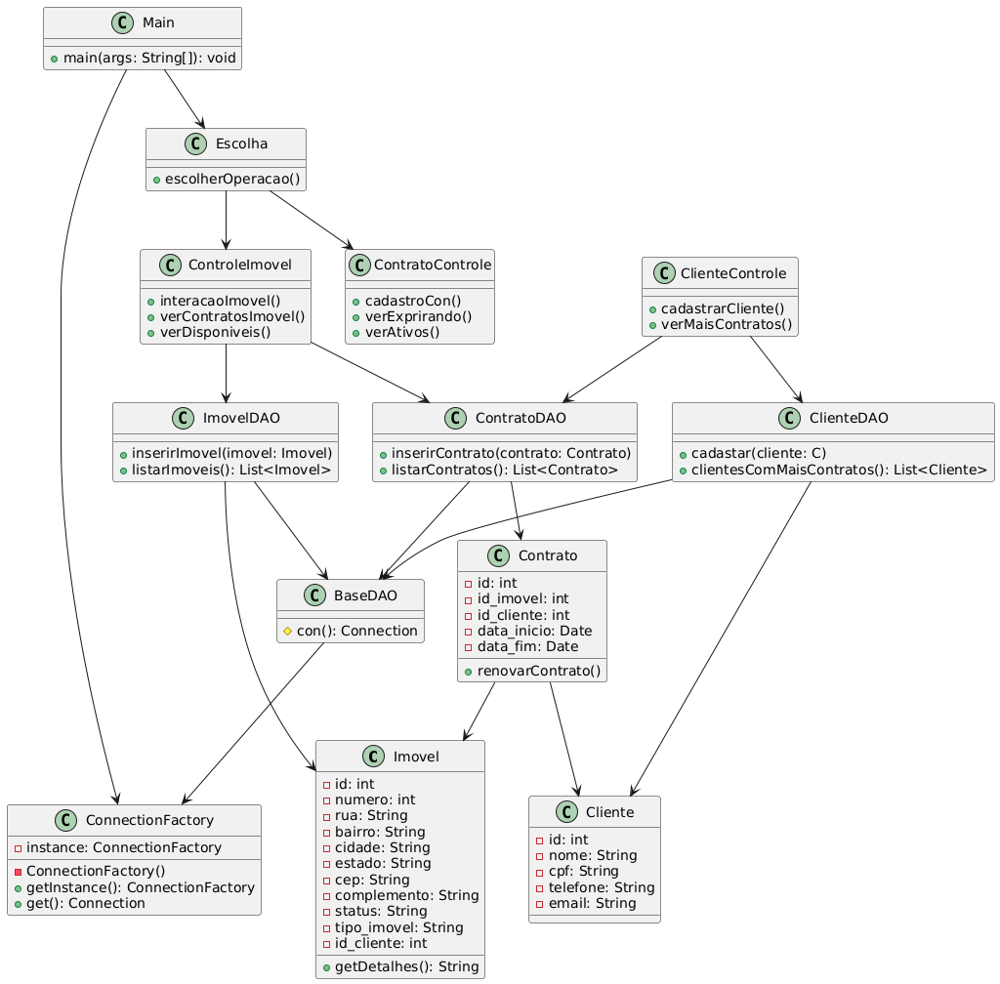

# 📌 Sistema de Gerenciamento de Imóveis e Contratos  

Este projeto é um **sistema acadêmico** desenvolvido em **Java (JDBC + MariaDB/MySQL)** para gerenciar imóveis, clientes e contratos de aluguel/compra.  

O sistema permite:  
- Cadastrar **clientes**.  
- Registrar **imóveis** disponíveis (aluguel ou venda).  
- Criar **contratos** de aluguel ou compra vinculados a clientes e imóveis.  
- Atualizar automaticamente o **status dos imóveis** e o **id_cliente** quando um contrato é criado.  
- Consultar contratos prestes a expirar (30 dias).
- Visualizar os clientes com mais contratos

---

## 🏗️ Estrutura do Banco de Dados  

As tabelas principais são:  

- **Cliente** → informações de clientes (nome, CPF, telefone, email).  
- **Imovel** → dados dos imóveis (endereço, tipo, status, id_cliente).  
- **Contrato** → contratos de aluguel ou compra vinculando cliente e imóvel.  

### 🔄 Lógica de atualização automática  
Ao cadastrar um contrato:  
- Se `tipoContrato = aluguel` → o imóvel passa para **alugado**.  
- Se `tipoContrato = compra` → o imóvel passa para **vendido**.  
- O campo `id_cliente` do imóvel é atualizado com o cliente que assinou o contrato.  

---

## ⚙️ Tecnologias Utilizadas  

- **Java**
- **MariaDB / MySQL**  
- **SQL (DDL & DML)**  
---

